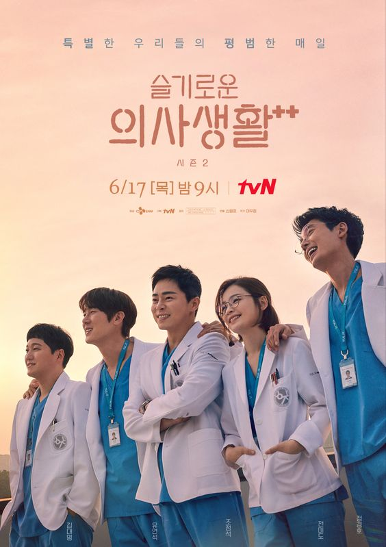

# welcome :)))

*this is a sample website thank you :>*

**Twenty Five Twenty One (2022)** 

<iframe width="560" height="315" src="https://www.youtube.com/embed/eNANbEMdLZA" title="YouTube video player" frameborder="0" allow="accelerometer; autoplay; clipboard-write; encrypted-media; gyroscope; picture-in-picture" allowfullscreen></iframe>

                      On-going drama 

Airing Time and Date 

Every Saturday and Sunday at 9:10pm KST at TvN  

New Episodes at Netflix every 10pm PHT 

Genre: Romatic Comedy, Coming of age 

Available Episodes in Netflix (as of today): 6 episodes

Total episodes: 16 

Starring Nam Joo-hyuk, Kim Tae-ri, WSJN Bona, Choi Hyun-wook, Lee Joo-myung

Synopsis from Swoon 

With her plans of being a professional fencer foiled by a sudden financial crisis in the 1990s, a passionate young high-schooler wonders if it’s time to give up on her dreams. But the hardworking part-timer at the comic book shop may be the kindred soul she needs to keep her spirits up—especially when they meet again at ages 25 and 21. 

**Episodes Release Dates**

| Episode | Release Date |
| ----------- | ----------- |
| Episode 1 | 02/12/2022 |
| Episode 2 | 02/13/2022 |
| Episode 3 | 02/19/2022 |
| Episode 4 | 02/20/2022 |
| Episode 5 | 02/26/2022 | 
| Episode 6 | 02/27/2022 |
| Episode 7 | 03/05/2022 |
| Episode 8 | 03/06/2022 |
| Episode 9 | 03/12/2022 |
| Episode 10 | 03/13/2022 |
| Episode 11 | 03/19/2022 |
| Episode 12 | 03/20/2022 |
| Episode 13 | 03/26/2022 |
| Episode 14 | 03/27/2022 |
| Episode 15 | 04/02/2022 |
| Episode 16 | 04/03/2022 |

**OST Playlist** 
<iframe style="border-radius:12px" src="https://open.spotify.com/embed/playlist/6eBCn56XBRFeEXbvDSAu5a?utm_source=generator" width="100%" height="380" frameBorder="0" allowfullscreen="" allow="autoplay; clipboard-write; encrypted-media; fullscreen; picture-in-picture"></iframe>

**Our Beloved Summer (2021-2022)** 

<iframe width="560" height="315" src="https://www.youtube.com/embed/p_dDoDQ8u94?start=37" title="YouTube video player" frameborder="0" allow="accelerometer; autoplay; clipboard-write; encrypted-media; gyroscope; picture-in-picture" allowfullscreen></iframe>

                      Completed 
                                   
                                   
Aired at SBS Last December 6, 2021 - January 25, 2022 at 9:00pm KST 

Available at Netflix

Genre: Drama Romantic Comedy 

Total Episodes: 16 (completed) 
 
Starred by Kim Dami, Choi Woosik, Kim Sung-cheol, 

**All of Us are Dead (2022)** 

<iframe width="560" height="315" src="https://www.youtube.com/embed/lzD2DS1fe6Y" title="YouTube video player" frameborder="0" allow="accelerometer; autoplay; clipboard-write; encrypted-media; gyroscope; picture-in-picture" allowfullscreen></iframe>

                     Completed

Released last January 28, 2022 at Netflix 

Released Date and Time: January 28, 2022 around 5pm KST 

Total Episodes: 12 

Genre: Zombie Apocalypse, Horror Fiction 

Starring Park Solomon, Choi Yihyun, Lee Chan-young Park Jih-oo, Lee Yoo-mi, Yoo In-so, Ha Seung-ri, Lee Eun-saem                  
                     
                     
                     
**Hospital Playlist (2020-2021)** 

                     Completed
                     
Season 1 released las March 12-May 28 2020 and Season 2 was realeased last June 17 - September 16, 2021                  

Available in Netflix 

Total Episodes: 24 (12 episodes per season) 

Genre: Romance, Medical drama, Comedy 

Cast: Jo Jung-sok, Jeon Mido, Jung Kyung-ho, Yoo Yeon-seok, Kim Dae-myung 
