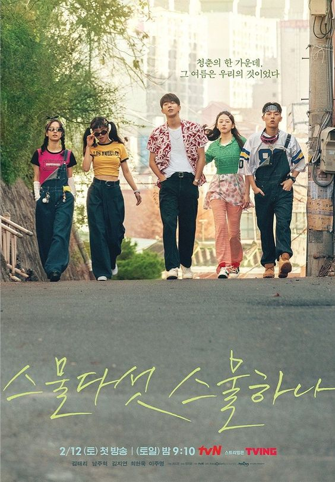

# welcome :)))

*this is a sample website thank you :>* 

# Korean Dramas 

**Twenty Five Twenty One**

[Trailer](https://youtu.be/gYp4cKumTwU)

[.jpg)](https://youtu.be/gYp4cKumTwU)

<iframe width="560" height="315" src="https://www.youtube.com/embed/PBCXHOskDQ4" title="YouTube video player" frameborder="0" allow="accelerometer; autoplay; clipboard-write; encrypted-media; gyroscope; picture-in-picture" allowfullscreen></iframe>

Airing Time and Date 
Every Saturday and Sunday at 9:10pm KST at TvN  

New Episodes at Netflix every 10pm PHT 

Starring Nam Joo-hyuk, Kim Tae-ri, WSJN Bona, Choi Hyun-wook, Lee Joo-myung

Synopsis from Swoon 

With her plans of being a professional fencer foiled by a sudden financial crisis in the 1990s, a passionate young high-schooler wonders if it’s time to give up on her dreams. But the hardworking part-timer at the comic book shop may be the kindred soul she needs to keep her spirits up—especially when they meet again at ages 25 and 21. 

| Episode | Release Date |
| ----------- | ----------- |
| Episode 1 | 02/12/2022 |
| Episode 2 | 02/13/2022 |
| Episode 3 | 02/19/2022 |
| Episode 4 | 02/20/2022 |
| Episode 5 | 02/26/2022 | 
| Episode 6 | 02/27/2022 |
| Episode 7 | 03/05/2022 |
| Episode 8 | 03/06/2022 |
| Episode 9 | 03/12/2022 |
| Episode 10 | 03/13/2022 |
| Episode 11 | 03/19/2022 |
| Episode 12 | 03/20/2022 |
| Episode 13 | 03/26/2022 |
| Episode 14 | 03/27/2022 |
| Episode 15 | 04/02/2022 |
| Episode 16 | 04/03/2022 |

# Our Beloved Summer 

Aired at SBS Last December 6, 2021 - January 25, 2022 at 9:00pm KST 
 
Starred by Kim Dami, Choi Woosik, Kim Sung-cheol, 

